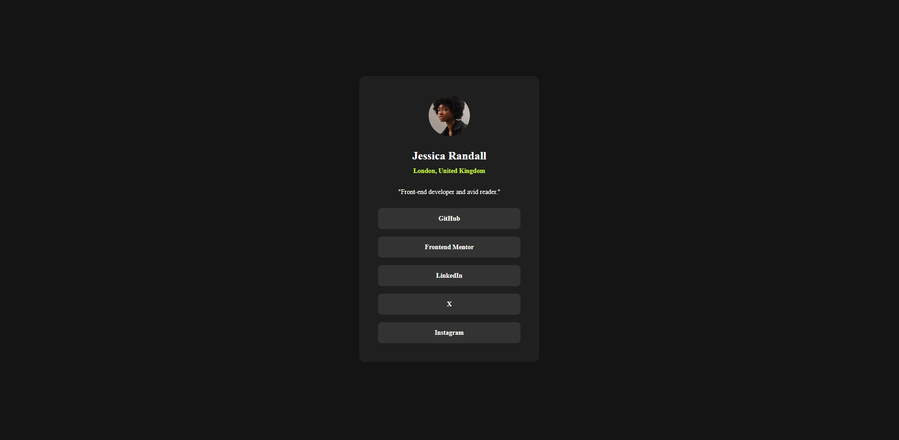

# Frontend Mentor - Social links profile solution

## Overview

This challenge was to build and deploy Frontend Mentor's Social links profile challenge.  Frontend Mentor provided various assets including the images, figma file, and style guide.

[Frontend Mentor Social links profile challenge](https://www.frontendmentor.io/challenges/social-links-profile-UG32l9m6dQ)

This challenge required knowledge of css, semantic HTML, and building a responsive website.

### Screenshot

### Links

- Solution URL: [github repository](https://github.com/ClassPython/fem-social-links-profile)
- Live Site URL: [github-pages](https://classpython.github.io/fem-social-links-profile/)

### Built with

- Semantic HTML5 markup
- CSS Flexbox
- Mobile first design

### What I learned

 - Created accessible external-link buttons using anchor and span tags, ensuring full compatibility with screen readers.

### Next Steps

- Completed the four Frontend Mentor projects under the newbie Learning Path; now progressing to the projects under the Building Responsive Websites Learning Path.